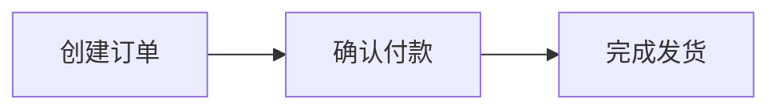
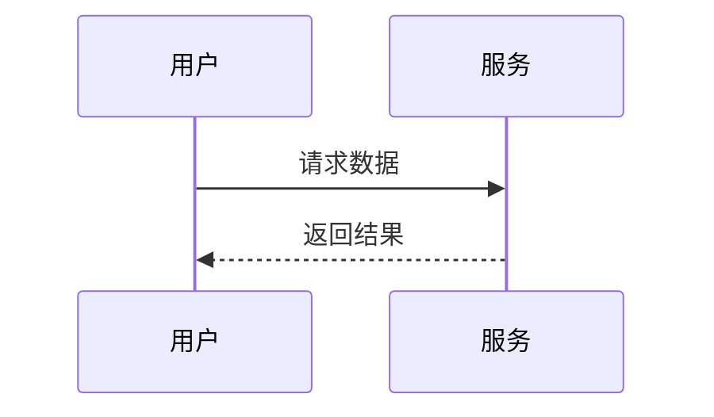

# Mermaid 导出测试

## 1. **订单流程** _⚠ 字号偏小_

```mermaid
flowchart LR
  A[创建订单] --> B[确认付款]
  B --> C[完成发货]
```

## 2. 消息时序

```mermaid
sequenceDiagram
  participant U as 用户
  participant S as 服务
  U->>S: 请求数据
  S-->>U: 返回结果
```
